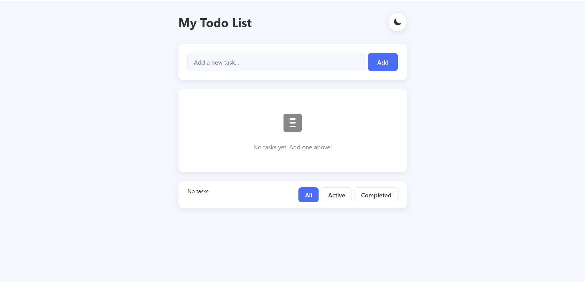
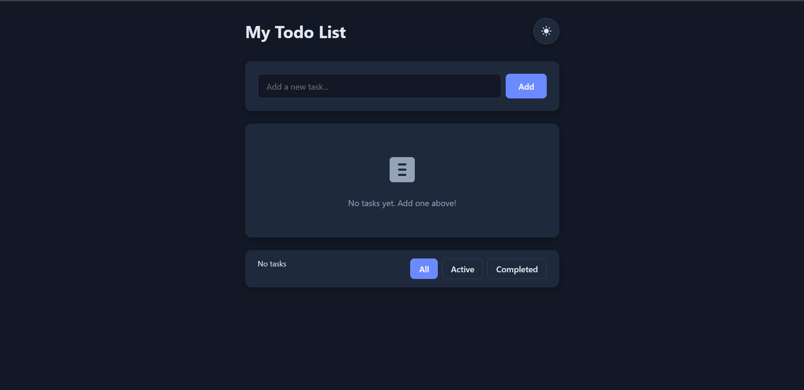

# ✅ Todo App

    A simple, clean, and responsive Todo List Application built using HTML, CSS, and JavaScript, featuring:

## 📸 Screenshots (Optional)

---


* ✅ Add, delete, and manage tasks
* ✅ Light/Dark theme toggle (saved in LocalStorage)
* ✅ Task filters: All / Active / Completed
* ✅ Auto-save tasks using LocalStorage
* ✅ Beautiful UI with empty-state UI

## 📌 Features
> 🌗 Theme Toggle


## ✅ Add & Manage Tasks
> Add new tasks

> Mark tasks as completed

> Delete tasks


## 🔍 Task Filtering

>Filter tasks by:

    All
    Active
    Completed
    📊 Task Counter


## 🛠️ Technologies Used
> HTML

> CSS	

> JavaScript	
## 📁 Folder Structure
```js  
├── index.html
├── style.css
└── script.js
```


##  Author

> Ravi Ranjan
Frontend Developer

> 🔗 GitHub: https://github.com/Raviranjanmishra01